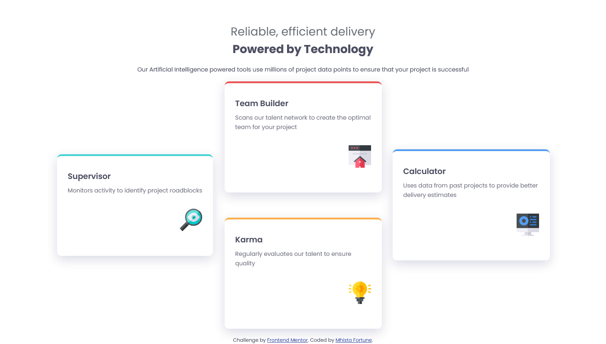
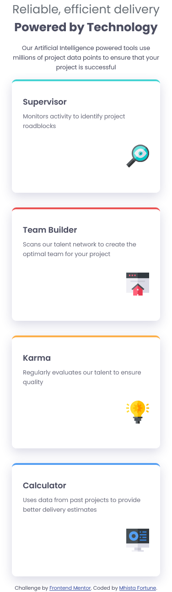

# Frontend Mentor - Four card feature section solution

This is a solution to the [Four card feature section challenge on Frontend Mentor](https://www.frontendmentor.io/challenges/four-card-feature-section-weK1eFYK). Frontend Mentor challenges help you improve your coding skills by building realistic projects. 

## Table of contents

  - [Overview](#overview)
  - [The challenge](#the-challenge)
  - [Screenshot](#screenshot)
  - [Links](#links)
  - [My process](#my-process)
  - [Built with](#built-with)
  - [Features](#features)
  - [Author](#author)
  - [Acknowledgments](#acknowledgments)

## Overview

This project displays four feature cards in a responsive grid layout. Each card highlights a different feature with a colored top border and an icon. The layout adapts for mobile and desktop screens.

### The challenge

Users should be able to:

- View the optimal layout for the site depending on their device's screen size

### Screenshot

### Links

- Solution URL: [Add solution URL here](https://github.com/Mhista-Fortune/Four-Card-Feature-Project/tree/main/four-card-feature-section-master)
- Live Site URL: [Add live site URL here](https://four-card-feature-project-kappa.vercel.app/)

### Built with

- Semantic HTML5 markup
- CSS custom properties
- Flexbox
- CSS Grid
- Mobile-first workflow
- [Google Fonts - Poppins](https://fonts.google.com/specimen/Poppins)

### Features

- Responsive design for mobile and desktop
- CSS Grid for desktop card arrangement
- Colored top borders for each card using HSL values
- Soft box-shadow for card elevation
- Accessible and semantic HTML

## Author

- Website - [Add your name here](https://www.your-site.com)
- Frontend Mentor - [@yourusername](https://www.frontendmentor.io/profile/yourusername)
- Twitter - [@yourusername](https://www.twitter.com/yourusername)

## Acknowledgments

- [Frontend Mentor](https://www.frontendmentor.io) for the challenge and design inspiration.